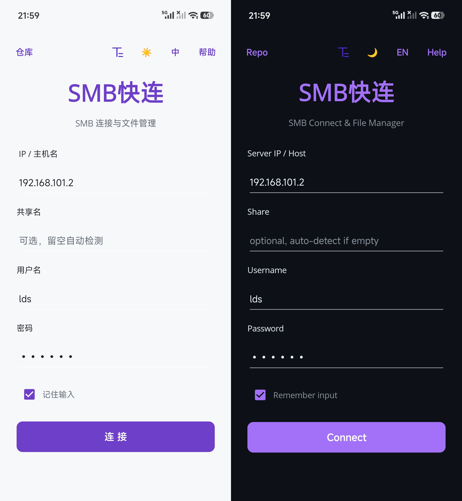
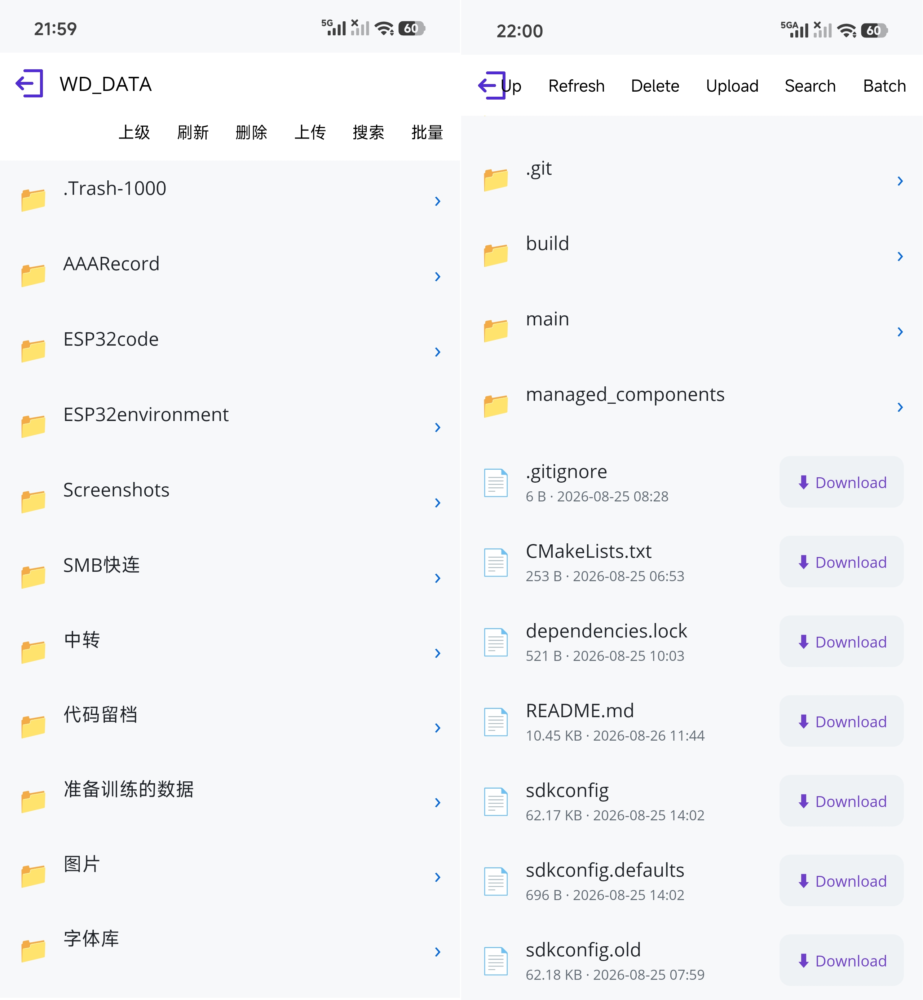

# SMB快连

基于 .NET MAUI 的 Android SMB 客户端，用于连接局域网 SMB 服务器，浏览共享目录、预览文件、单个/批量下载。

## 预览

  
  
连接页面，包含主题切换、单/多行显示、语言切换、帮助

    
  
文件浏览页面，包含单/多行导航栏、页面显示、可用功能

## 功能

- SMB 连接：支持 IP、端口、共享名，SMB2/3 优先、自动回退 SMB1，提供自动检测
- 主题：暗色/亮色切换
- 语言：中文/英文切换
- 帮助：快速使用知道
- 导航栏切换：可设置为单行或多行显示（路径和功能是否分开）
- 文件管理：目录浏览、搜索、文件预览（视频调系统播放器）
- 下载：单个下载与批量下载，保存到手机「download」目录
- 删除：可删除单个或多个文件
- 上传：上传文件
- 搜索：可搜索当前目录下的文件/文件夹

## 使用说明

1. 打开应用，输入服务器 IP、用户名、密码
2. 连接成功后选择共享，进入文件管理
3. 点击文件夹进入，点击文件预览；右侧按钮单个下载，顶栏「批量」可多选下载
4. 更多说明见应用内「帮助」按钮

## 技术文档

架构说明、每个文件的用途、所用包、主题与语言切换机制、常见踩坑点，详见 [Markdown/技术文档.md](Markdown/技术文档.md)。
